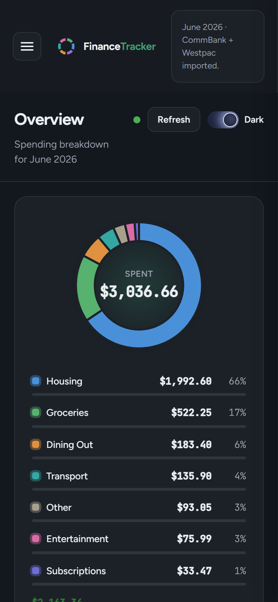

# FinanceTracker

A private, self-hosted personal finance tracker. It turns monthly Commonwealth Bank and Westpac CSV exports into a categorised spending breakdown, shown on a desktop dashboard and an installable phone PWA with a sidebar, a light and dark theme, and an animated donut.

You run it on your own machine, with your own API keys. Nothing here is a hosted service: this repo is the scaffolding. You bring the keys and the data, and all of the data stays on your hardware.

<p align="center">
  
</p>

*The screenshot uses synthetic demo data generated in code — no real transactions, in keeping with the rest of the repo.*

## Why it exists

There is no free, fully automated way for an individual in Australia to pull CommBank/Westpac data programmatically (the Consumer Data Right requires an accredited recipient in the middle). FinanceTracker accepts a two minute manual step each month, downloading two CSVs, in exchange for zero running cost and total data control. Everything after the download is automated: parsing, deduping, categorising, storing, and charting.

## Privacy model

Privacy is the whole point, and it is a property of the design rather than a promise.

- Raw bank data (CSV inputs, the SQLite database, generated Excel files, run logs) never leaves your machine and is never committed to git.
- The only thing sent off-machine is a sanitised tuple: `(row_index, cleaned_description, amount)`. No account numbers, BSBs, card numbers, balances, names, references, or memos.
- A mandatory sanitiser runs before any network call. It strips identifiers, regex-scrubs names and reference codes embedded in descriptions, removes every digit run, and fails closed: if a field cannot be confidently cleaned, the row is dropped rather than risk sending it.
- The only external endpoint is OpenRouter, used for categorisation. It sees a stream of merchant-and-amount pairs that could belong to anyone.
- Every sanitised payload is written to a local audit log so you can verify exactly what left the machine.

Git safety is enforced by hooks in `.githooks/`: a pre-commit hook blocks committing any bank data or credentials, and a commit-msg hook blocks attribution trailers.

## Architecture

One brain, two windows. A single FastAPI backend on your laptop owns all data and logic. The desktop dashboard and phone PWA are stateless views that read from it, so they can never disagree.

```
  Phone PWA  ─┐                        ┌─ Desktop dashboard
              │  HTTP over Tailscale   │  HTTP over localhost
              └──────────┬─────────────┘
                         v
          FastAPI backend (the single brain)
          parse -> dedupe -> sanitise -> categorise -> store -> excel -> drive
                         │
              ┌──────────┴──────────┐
         SQLite (local)        Outbound calls
         transactions,         OpenRouter (sanitised pairs only),
         categories,           Google Drive (Excel workbook)
         fingerprints
```

## Stack

FastAPI and SQLite backend, Vite PWA frontend (desktop dashboard and phone), Chart.js for the donut chart, openpyxl for Excel, Google Drive API (service account) for the workbook, OpenRouter (free tier) for categorisation, Tailscale for private networking, Windows Task Scheduler for always-on auto-start.

## Repository layout

```
backend/
  data_source/     per-bank CSV parsers (CommBank, Westpac profiles)
  idempotency/     file and transaction fingerprinting
  sanitiser/       reduce to (index, clean description, amount); fail closed
  analyser/        OpenRouter client (default plus fallback model)
  store/           SQLite access layer and taxonomy
  excel_builder/   openpyxl workbook
  drive_uploader/  Google Drive service-account upload
  app.py           FastAPI endpoints (/upload, /status, /summary)
  pipeline.py      orchestration
frontend/          Vite PWA: sidebar shell, light/dark theming, animated donut, upload UI, queue-and-retry
service/           Windows Task Scheduler auto-start scripts
```

## What you need

Required:

- **Python 3.11+** and **Node 18+**.
- **An OpenRouter API key** (free). Sign up at [openrouter.ai](https://openrouter.ai), create a key, and disable prompt logging/training in your account's privacy settings. Categorisation runs on free-tier models, so there is no per-call cost.

Optional. Each of these gates a feature that is simply skipped or inert while unconfigured:

- **Google Drive service account**, for uploading the monthly Excel workbook. In Google Cloud console: create a project, enable the Drive API, create a service account, download its JSON key, and share the target Drive folder with the service account's email address.
- **VAPID key pair**, for phone push notifications. `pip install pywebpush`, generate with `vapid --gen`, and fill the three `VAPID_*` values in `.env`. Push stays fully inert while `PUSH_ENABLED=false`.
- **Tailscale** on the laptop and the phone (free Personal plan), for private phone access. Without it the app is desktop-only.

## Getting started

### 1. Backend

```bash
python -m venv venv
# Windows:  venv\Scripts\activate
# macOS/Linux:  source venv/bin/activate
pip install -r requirements.txt

cp .env.example .env      # then fill in the values (see Configuration below)

python -m uvicorn backend.app:app --host 0.0.0.0 --port 8010
```

### 2. Frontend

```bash
cd frontend
npm install
cp .env.example .env      # optional: override VITE_API_BASE if the backend is elsewhere
npm run dev
```

### 3. Use it

Open the dashboard, upload your CommBank and Westpac CSVs, and the backend parses, sanitises, categorises, stores, and returns a breakdown. Re-running on unchanged files is a no-op (no categorisation call, no changed output).

### 4. Phone access (production build over Tailscale)

The installable phone PWA needs HTTPS (service worker and push both require it), which Tailscale provides privately inside your own tailnet. Nothing is exposed to the public internet.

1. Install Tailscale on the laptop and the phone, sign in to the same tailnet, and enable MagicDNS and HTTPS certificates in the Tailscale admin console. Note your machine's DNS name (`<machine>.<tailnet>.ts.net`).
2. Create `frontend/.env.production` (gitignored) with the production values, then build:

   ```bash
   # frontend/.env.production
   VITE_API_BASE=https://<machine>.<tailnet>.ts.net:8443
   VITE_VAPID_PUBLIC_KEY=<your public key, only if using push>

   cd frontend && npm run build
   ```

3. Allow the phone origin to call the API, in `.env`:

   ```
   CORS_ALLOW_ORIGINS=https://<machine>.<tailnet>.ts.net
   ```

4. Map two tailnet-only HTTPS listeners to the local servers (these persist across reboots):

   ```
   tailscale serve --bg --https=443  http://127.0.0.1:4173
   tailscale serve --bg --https=8443 http://127.0.0.1:8010
   ```

5. Serve `frontend/dist` on port 4173. The always-on service below does this for you; manually it is `python -m http.server 4173 --bind 127.0.0.1 --directory frontend/dist`.
6. On the phone, open `https://<machine>.<tailnet>.ts.net/` in the browser and add it to the Home Screen (on iOS: Safari, Share, Add to Home Screen - required for push, iOS 16.4+). Open it from the Home Screen icon.

## Dashboard

The interface is an app shell with a sidebar and a light and dark theme toggle (your choice is remembered). The Overview screen shows:

- An animated donut of spending by category, with the month's total counting up in the centre and a legend whose bars fill in per category.
- A "small servo spends" toggle. Fuel and convenience stops (BP, 7-Eleven, Ampol, Shell, Caltex, Coles Express, Reddy Express) under $10 are usually a coffee or a snack, not fuel, so one switch reclassifies those from Transport to Dining Out for the month. Anything over $10 stays Transport, and travel-only fares (Opal, Myki, SkyBus) are never touched. The change is saved locally and is fully reversible.

The phone PWA is the same view over Tailscale, with client-side queue-and-retry, so an upload made while the laptop is asleep is held and retried until it lands.

## Configuration

All backend config lives in `.env` (gitignored). Copy `.env.example` and fill it in. The important values:

| Variable | Purpose |
|---|---|
| `OPENROUTER_API_KEY` | Your OpenRouter key (free tier). Disable data retention in your OpenRouter account. |
| `OPENROUTER_MODEL` | Default free model slug. Copy the exact slug from the model's page on openrouter.ai. |
| `OPENROUTER_FALLBACK_MODEL` | Fallback free model, used on error, 429, or unparseable JSON. |
| `GOOGLE_SERVICE_ACCOUNT_JSON` | Path to a Drive service-account key file (optional). Upload is skipped if absent. |
| `DRIVE_FOLDER_ID` | Target Drive folder for the workbook (optional). |
| `SQLITE_PATH`, `INBOX_DIR`, `OUTPUT_DIR`, `LOG_DIR` | Local paths, all gitignored. |
| `BACKEND_HOST`, `BACKEND_PORT` | Bind address and port (examples in this readme use `8010`). |
| `CORS_ALLOW_ORIGINS` | Comma-separated origins allowed to call the API. Set your tailnet URL here for phone access. |
| `PUSH_ENABLED`, `VAPID_PUBLIC_KEY`, `VAPID_PRIVATE_KEY`, `VAPID_SUBJECT` | Web Push notifications. Fully inert while `PUSH_ENABLED=false`. |

The LLM model is config, not code. Swap models by editing `.env`, no code change.

Frontend config is non-secret: `VITE_API_BASE` (backend URL) and `VITE_VAPID_PUBLIC_KEY` (the public half of the VAPID pair, safe to bake into the build). Put dev values in `frontend/.env`, phone-build values in `frontend/.env.production`. Never put a key or credential in any frontend file.

## Bank CSV formats

Both banks normalise to one internal shape: `date`, `description`, `amount` (signed, debit negative, credit positive).

- CommBank (NetBank desktop export): no header row, columns are `date, amount (signed), description, balance`.
- Westpac: header row present, the leading account-number column is dropped, and split debit/credit columns are merged into one signed amount.

Format knowledge lives in per-bank profiles, so a wrong assumption is a one-place fix. You do not have to match a file to the right upload box either: the app detects which bank a CSV is from by its contents, so a file dropped in the wrong slot still parses correctly, and a file that matches neither format is rejected with a clear message instead of failing silently.

## Categories

A fixed taxonomy of eight: Groceries, Housing, Dining Out, Transport, Entertainment, Subscriptions, Income, Other. Housing covers rent and utilities. Each category also carries editable merchant hints (the Categories screen) that are prepended to the categorisation prompt, and one-tap corrections from the drill-down drawer can opt in to feed few-shot examples back into future runs.

## Tests

```bash
# backend
python -m pytest

# frontend
cd frontend && npm test
```

Tests use synthetic data generated in code, never real transactions. The suite makes no live network calls: the OpenRouter client is mocked.

## Always-on service

The app is most useful when the backend and the built PWA server are simply always running, so the phone works whenever the laptop is on. On Windows, `service/` ships everything needed:

```powershell
pwsh .\service\register-task.ps1     # one-time install; remove with -Unregister
```

That registers a single Task Scheduler task named `FinanceTracker`. If you prefer to create the task by hand (or want to audit what the script does), this is everything it contains:

| Piece | Value |
|---|---|
| Action | `<repo>\venv\Scripts\pythonw.exe "<repo>\service\supervisor.py"`, working directory `<repo>` |
| Triggers | At log on, and on workstation unlock |
| Security | Run only when the user is logged on, lowest privileges (no admin) |
| Settings | One instance only (ignore new); restart on failure 3 times, 1 minute apart; no execution time limit; run task as soon as possible after a missed start; do not stop on battery |

Two design points worth copying if you roll your own:

- **`pythonw.exe`, not `python.exe` or PowerShell.** `pythonw` is the console-less Python, so no terminal window can ever appear. Launching via `powershell.exe -WindowStyle Hidden` can still show a window when Windows Terminal is the default console host, and closing that window kills the server.
- **The task runs a supervisor, not the servers directly.** `service/supervisor.py` probes the backend port (`BACKEND_PORT` from `.env`) and the web port (4173) every 15 seconds and relaunches whichever server is down, logging to `logs/` (gitignored). Cost is roughly 15 MB of RAM and no measurable CPU. It also runs in a normal console for testing: `venv\Scripts\python.exe service\supervisor.py`.

On macOS, use a launchd LaunchAgent with `RunAtLoad` and `KeepAlive`; on Linux, a systemd user service with `Restart=always`. Point either at `venv/bin/python service/supervisor.py` and the same behaviour follows.

## Feature set

The current build covers the full loop described above, plus: monthly and yearly views with period-over-period changes, category trend charts, a category drill-down drawer with one-tap corrections (shown only when learned corrections are enabled in Settings), per-category merchant hints, notifications (in-app toasts while the app is focused, Web Push when backgrounded), a Settings tab (per-notification-type toggles, CSV backup and reset, categoriser test, learned-corrections management), `.xlsx` statement upload, and content-based bank detection.

Newest additions (v6), all local heuristics over data already on your machine — nothing new is sent off-machine:

- **Transaction search**: full-text search across every stored transaction (SQLite FTS5, with a plain-LIKE fallback when FTS5 is unavailable).
- **Internal transfer netting**: money moved between your own accounts shows up in both banks' CSVs and double-counts as spending. Matched opposite-sign pairs within a small date window are tagged as transfers and excluded from the totals — and from the categorisation payload entirely. A Transfers view lists each pair with a "Not a transfer" undo, and a notification tells you when new pairs are netted.
- **Budget alerts**: per-category monthly budgets set in Settings, checked after each run, fired once per category per month at 80% and 100% through the normal notification channels. Alert payloads carry only a category name and a percent — never amounts or descriptions.
- **Subscription watch**: recurring-merchant detection that flags a new subscription appearing, a price change on an existing one, or an expected income deposit that did not arrive.

And from v7, the quality-of-life layer:

- **Automatic database backups**: the always-on supervisor snapshots the SQLite database weekly (SQLite online-backup API, safe while the app runs), keeping the 8 newest local copies.
- **Transfers badge**: an unseen-count badge on the Transfers nav item; opening the view clears it.
- **Net position chart**: month-end closing balances (derived from each CSV) stored per bank and drawn as a net-position line chart in Trends, with honest gaps for months without data.
- **Categoriser scorecard**: a monthly accuracy card in Settings built from recategorisation events (categories and timestamps only), showing whether the categoriser improves over time.

## License

MIT. See [LICENSE](LICENSE).
